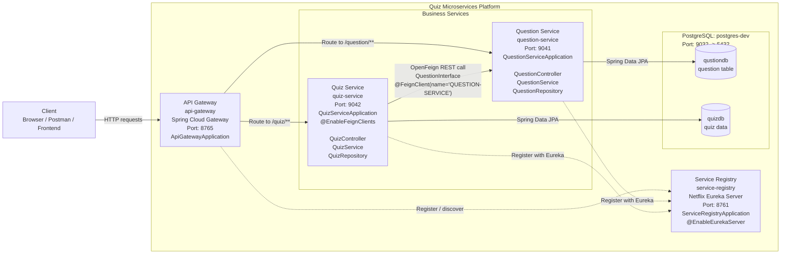
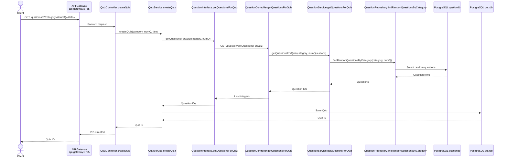
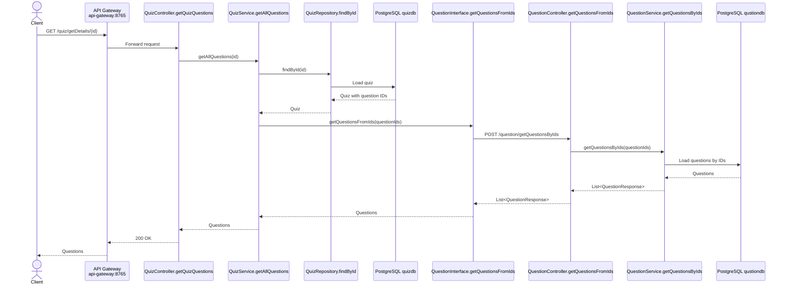
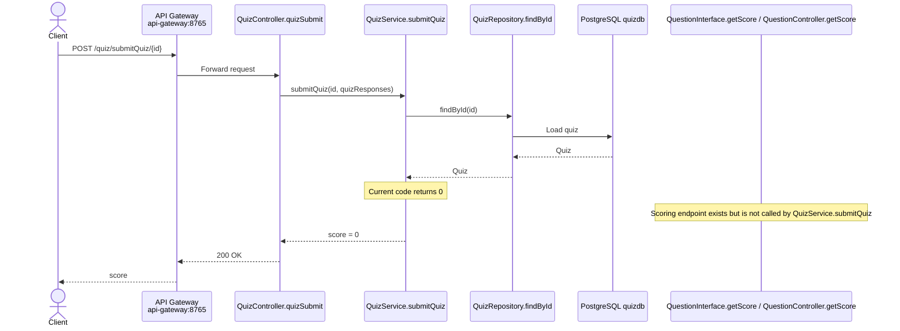

# Quiz Microservices Architecture

This document describes the current microservices architecture for the Quiz application.

## Architecture Diagram

## Request Flow: Create Quiz

## Request Flow: Get Quiz Details

## Request Flow: Submit Quiz

## Service Endpoint Summary

### Question Service

Base path is defined in `QuestionController` as `/question`.

| Method | Endpoint | Handler |
|---|---|---|
| GET | `/question/allQuestions` | `QuestionController.getQuestions()` |
| GET | `/question/category/{category}` | `QuestionController.getQuestionsByCategory(String category)` |
| POST | `/question/add` | `QuestionController.addQuestion(QuestionRequest questionRequest)` |
| GET | `/question/getQuestionsForQuiz` | `QuestionController.getQuestionsForQuiz(String category, Integer numQuestions)` |
| POST | `/question/getQuestionsByIds` | `QuestionController.getQuestionsFromIds(List<Integer> questionIds)` |
| POST | `/question/getScore` | `QuestionController.getScore(List<QuizResponse> quizResponses)` |

### Quiz Service

Base path is defined in `QuizController` as `/quiz`.

| Method | Endpoint | Handler |
|---|---|---|
| GET | `/quiz/create` | `QuizController.createQuiz(String category, int numQ, String title)` |
| GET | `/quiz/getDetails/{id}` | `QuizController.getQuizQuestions(Integer id)` |
| POST | `/quiz/submitQuiz/{id}` | `QuizController.quizSubmit(Integer id, List<QuizResponse> quizResponses)` |

## Code References

- `ServiceRegistryApplication`: `service-registry/src/main/java/com/learning/service_registry/ServiceRegistryApplication.java`
- `ApiGatewayApplication`: `api-gateway/src/main/java/com/learning/api_gateway/ApiGatewayApplication.java`
- `QuestionController`: `question-service/src/main/java/com/learning/question/controller/QuestionController.java`
- `QuestionService`: `question-service/src/main/java/com/learning/question/service/QuestionService.java`
- `QuestionRepository`: `question-service/src/main/java/com/learning/question/respository/QuestionRepository.java`
- `QuizServiceApplication`: `quiz-service/src/main/java/com/learning/quiz/QuizServiceApplication.java`
- `QuizController`: `quiz-service/src/main/java/com/learning/quiz/controller/QuizController.java`
- `QuizService`: `quiz-service/src/main/java/com/learning/quiz/service/QuizService.java`
- `QuizRepository`: `quiz-service/src/main/java/com/learning/quiz/respository/QuizRepository.java`
- `QuestionInterface`: `quiz-service/src/main/java/com/learning/quiz/feign/QuestionInterface.java`
- Runtime setup: `docker-compose.yaml`
