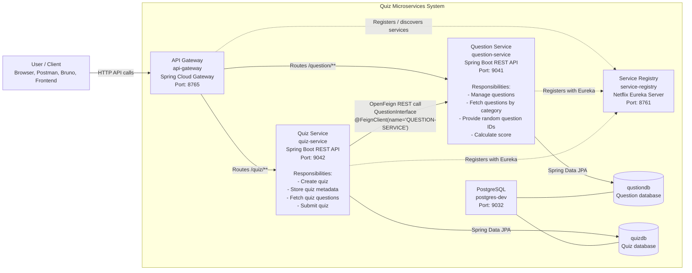

# Quiz Microservices Design

## Code References

- `ServiceRegistryApplication`: `service-registry/src/main/java/com/learning/service_registry/ServiceRegistryApplication.java`
- `ApiGatewayApplication`: `api-gateway/src/main/java/com/learning/api_gateway/ApiGatewayApplication.java`
- `QuestionController`: `question-service/src/main/java/com/learning/question/controller/QuestionController.java`
- `QuizController`: `quiz-service/src/main/java/com/learning/quiz/controller/QuizController.java`
- `QuestionInterface`: `quiz-service/src/main/java/com/learning/quiz/feign/QuestionInterface.java`
- Runtime setup: `docker-compose.yaml`